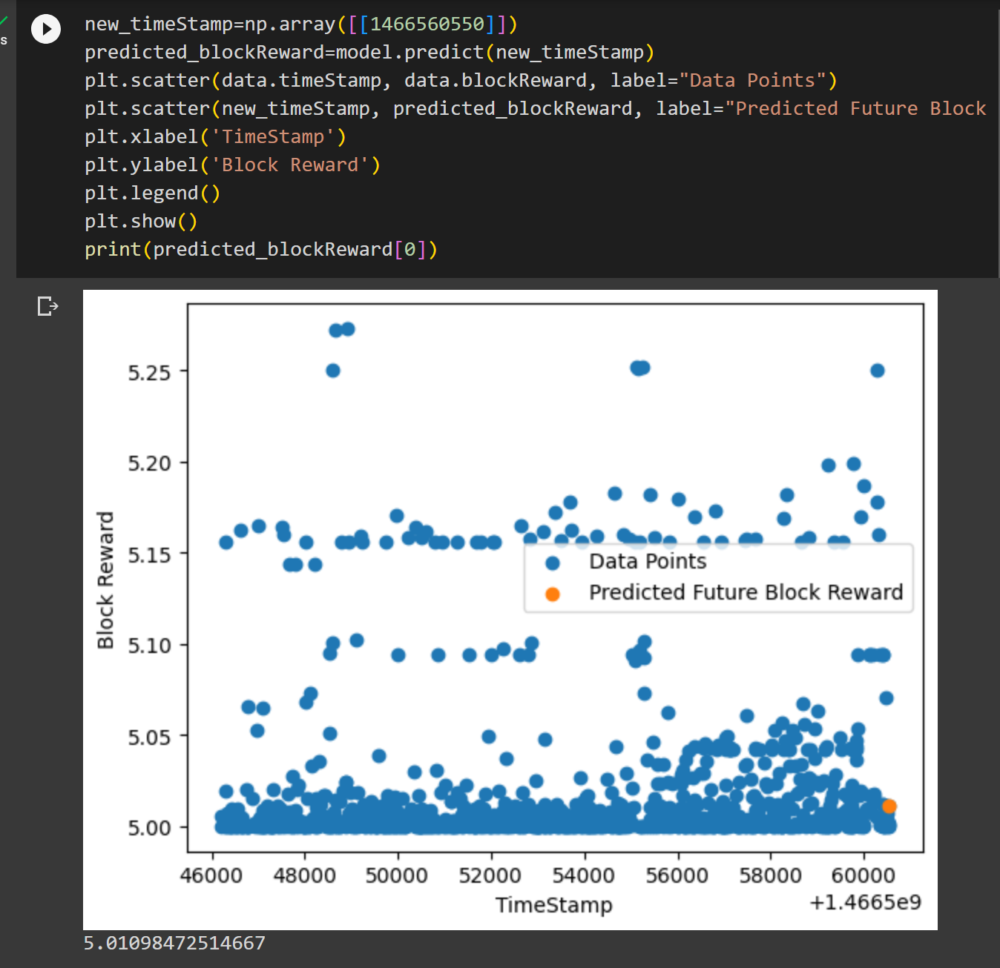

# Miner Rewards Prediction

## Overview
This is an AI-Blockchain project in which we predict miner rewards from existing dataset fetched live from blockchain.
1. 

2.  

3.  

## Dataset
The dataset is fetched from [EtherScan](https://etherscan.io/) using [EtherScan API](https://etherscan.io/apis). The dataset contains the following features:
- `blockNumber`: Block Number
- `timeStamp`: Timestamp

## Model
We have used a simple Linear Regression model to predict the miner rewards. The model is trained on the dataset and the model is saved in the `model` directory.

## Usage
To run the project, follow the steps below:
- Clone the repository
-  `cd` into the directory
-  install dependencies by typing yarn install
-  look upto colab file for running python side of the project
-  it is done. 

# About the Developer

Hello everyone, myself **Mohammad Ayaan Siddiqui** from India. I am a Full Stack WEB3 developer and a **DECENTRALIZATION MAXI**. I talk about WEB3, Cryptocurrencies, Javascript and Python and currently learning web3.

**Currently Learning and Building in React.js, Next.js, Solidity, Golang, Hardhat, Ethers.js, React Native, Tailwind, Html, CSS, Python, etc.**

If you are interested in either of the topics or building in similar skills, connect with me below:-

1.  [My Linktree with ALL SOCIALS](https://linktr.ee/ayaaneth)

2.  [Connect on Github](https://github.com/moayaan1911)

3.  [Connect on Linkedin](www.linkedin.com/in/ayaaneth)
4.  [Connect on Hashnode](https://moayaan.hashnode.dev/)

5.  [Connect on Twitter](https://www.twitter.com/usdisshitcoin)

6.  [Connect on Telegram](https://t.me/usdisshitcoin)

7.  [Connect on dev.to](https://dev.to/moayaan1911)